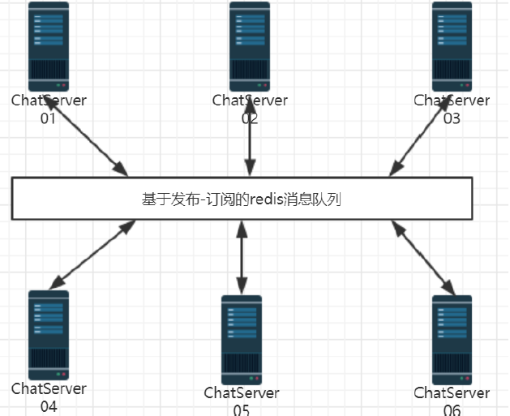

# Redis 环境搭建

## 简介



当部署多台服务器用于运行项目程序时，redis 作为中间件消息队列，用于登录在不同服务器上的用户进行通信。

## redis 环境安装与配置

### redis 服务端

```bash
# ubuntu 环境安装 redis
$ sudo apt-get install redis-server

# 启动服务端
$ redis-server

# 查看 redis 服务启用状态
# redis 默认工作在本地主机的 6379 端口
$ ps -ef | grep redis
chang     1657  1505  0 14:08 pts/8    00:00:00 redis-server *:6379
chang     1750  1695  0 14:08 pts/9    00:00:00 grep --color=auto redis
```

### redis C++ 编程客户端：hires

+ 下载源码

  ```bash
  $ git clone https://github.com/redis/hiredis
  ```

+ 编译

  ```bash
  $ cd hiredis
  $ make
  ```

+ 安装

  ```bash
  $ sudo make install
  ```

+ 更新动态链接库

  ```bash
  $ sudo ldconfig /usr/local/lib
  ```

## redis 相关命令

### 启动 redis-cli 客户端

```bash
$ redis-cli
127.0.0.1:6379> 
```

### 存储键值对

```bash
127.0.0.1:6379> set 1 "zhang san"
OK
127.0.0.1:6379> get 1
```

### 支持事务处理，多线程安全

```bash
127.0.0.1:6379> set num 1
OK
127.0.0.1:6379> INCR num
(integer) 2
127.0.0.1:6379> INCR num
(integer) 3
```

### 列表操作

```bash
127.0.0.1:6379> lpush arr a
(integer) 1
127.0.0.1:6379> lpush arr b
(integer) 2
127.0.0.1:6379> lpush arr c
(integer) 3
127.0.0.1:6379> lpush arr d
(integer) 4
127.0.0.1:6379> LRANGE 0 -1
(error) ERR wrong number of arguments for 'lrange' command
127.0.0.1:6379> LRANGE arr 0 -1
1) "d"
2) "c"
3) "b"
4) "a"
127.0.0.1:6379> RPOP arr
"a"
127.0.0.1:6379> LRANGE arr 0 -1
1) "d"
2) "c"
3) "b"
```

## 参考

+ [Linux下Redis的安装、配置及开机自启动-阿里云开发者社区 (aliyun.com)](https://developer.aliyun.com/article/789869)